## Principios del análisis gráfico 

- Principio 1: Mostrar comparaciones

 - La evidencia de una hipótesis siempre es __*relativa*__ con respecto a una hipótesis
 - Siempre pregunta "¿Comparado con que?"

---

##  Mostrar comparaciones

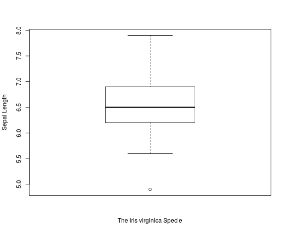

---
## Mostrar comparaciones 

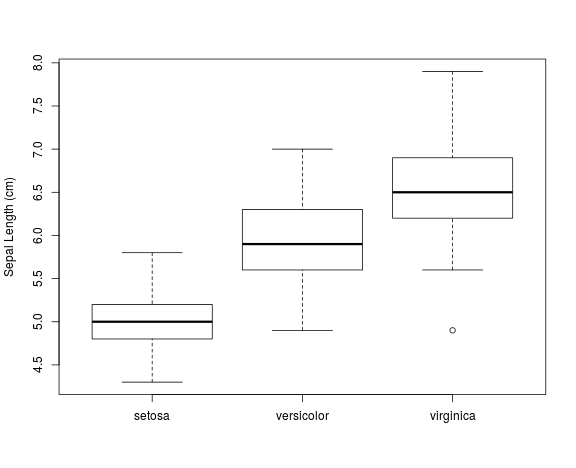

---

## Principios del análisis gráfico 

- Principio 1: Mostrar comparaciones

 - La evidencia de una hipótesis siempre es *relativa* con respecto a otra hipótesis
 - Siempre pregunta "¿Comparado con que?"

- Principio 2: Mostrar causalidad, el mecanismo, la explicación, la estructura sistemática
 - ¿Cuál es su marco causal para pensar en una pregunta?

---

## Mostrar Causalidad
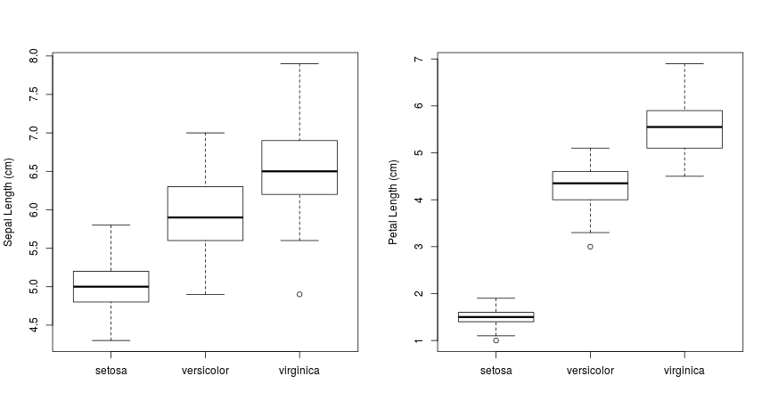

---

## Principios del análisis gráfico 

* Principio 1: Mostrar comparaciones

- La evidencia de una hipótesis siempre es *relativa* con respecto a otra hipótesis
 - Siempre pregunta "¿Comparado con que?"
 
* Principio 2: Mostrar causalidad, el mecanismo, la explicación, la estructura sistemática
 - ¿Cuál es su marco causal para pensar en una pregunta?

* Principio 3: Mostrar datos multivariados

 - Multivariado = más de 2 variables
 - El mundo real es multivariado

---

## Mostrar datos multivariados

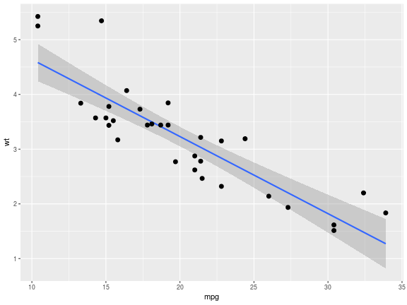

---

## Mostrar datos multivariados

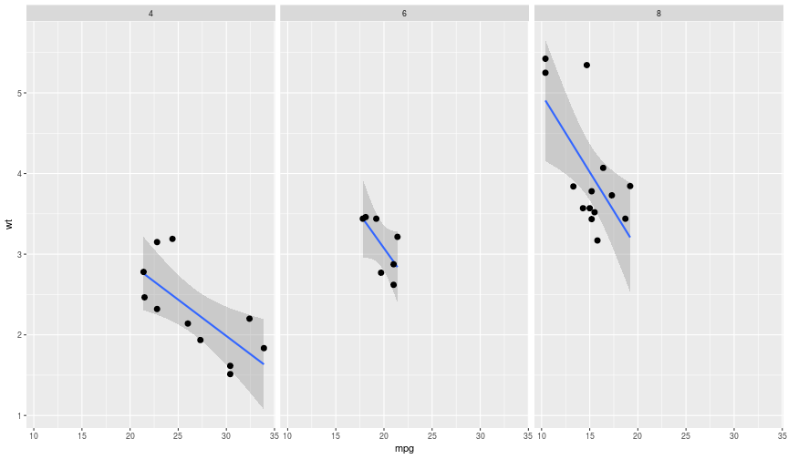

---
## Principios del análisis gráfico 

* Principio 4: Integración de evidencias
 
 - Integrar palabras, números, imágenes, diagramas
 - Gráficos que deben hacer uso de muchos modos de presentación de datos

---

## Integrar diferentes formas de evidencias 


---

## Principios del análisis gráfico 

* Principio 4: Integración de evidencias
 
 - Integrar palabras, números, imágenes, diagramas
 - Gráficos que deben hacer uso de muchos modos de presentación de datos
 
* Principio 5: Describir y documentar la evidencia con 
  las adecuadas etiquetas, escalas, fuentes, etc.

 - Un gráfico de datos debe contar una historia completa que sea creíble

---
## Principios del análisis gráfico 

* Principio 4: Integración de evidencias
 
 - Integrar palabras, números, imágenes, diagramas
 - Gráficos que deben hacer uso de muchos modos de presentación de datos
 
* Principio 5: Describir y documentar la evidencia con 
  las adecuadas etiquetas, escalas, fuentes, etc.

 - Un gráfico de datos debe contar una historia completa que sea creíble

* Principio 6: El contenido manda

 - Representaciones analíticas en última instancia, suben o bajan de calidad 
   debido a la pertinencia e integridad de su contenido.  

---

## Resumen

> * Principio 1: Mostrar comparaciones
> * Principio 2: Mostrar la causalidad, el mecanismo, la explicación
> * Principio 3: Mostrar datos multivariados
> * Principio 4: Integrar diferentes formas de evidencias 
> * Principio 5: Describir y documentar la evidencia
> * Principle 6: El contenido manda

---

## El sistema base de gráficos 

- Modelo "Canvas"
- Comienza con un lienzo en blanco y construye el gráfico desde allí 
- Comienza con una función `plot` (o similar)
-Utiliza funciones de anotación (segundo nivel) para añadir/modificar capas del gráfico (`text`, `lines`, `points`, `axis`)

---

## El sistema base de gráficos 


- Tiene la ventaja de que permite la construcción de gráficos por capas extremadamente detallados 

- No puedes editar el código una vez hayas empezado (p.e. ajustar los margenes)

- Dificulta la trasmisión de código 

- Los gráficos se convierten en una serie de comandos 

---

## Gráfico Base

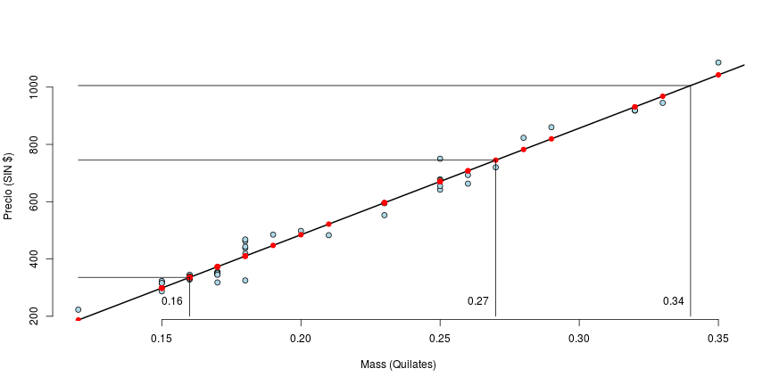

---

## El sitema Lattice 

- Los gráficos son creados con una llamada a una sola función (`xyplot`, `bwplot`, etc.)

- Es mucho más versátil para gráficos condicionales: Donde se miran relaciones entre variable en presencia de una variable auxiliar (factor)

- Cosas como margenes o espaciado se generan automáticamente debido a que el gráfico se genera en una sola función 

- Excelente para mostrar gráficos en una sola ventana 

---

## El sitema Lattice 

- A veces no es tan cómodo crear un gráfico en una sola llamada a una función

- Las anotaciones (funciones de bajo nivel) no son tan intuitivas 

- El uso de funciones panel y subíndices son difíciles de manejar, requiere una buena preparación 

- No se puede adicionar nada al gráfico una vez se creo

---

## Gráfico Lattice 

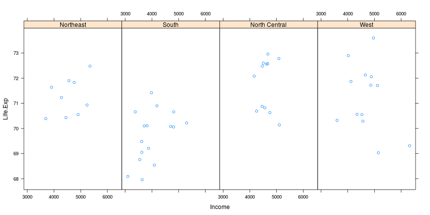

---

## El sistema ggplot2 

- Divide la diferencia entre el sistema base y lattice de muchas formas

- Trata de forma automática con el espaciado, texto, títulos pero de igual forma permite añadir capas al gráfico mediante el operador adición `+`

- De manera visual se comporta parecido a lattice pero generalmente es más intuitivo y fácil de utilizar

- Por defecto escoge muchas opciones del gráfico pero permite un alto grado de personalización

---

## Gráfico ggplot2 

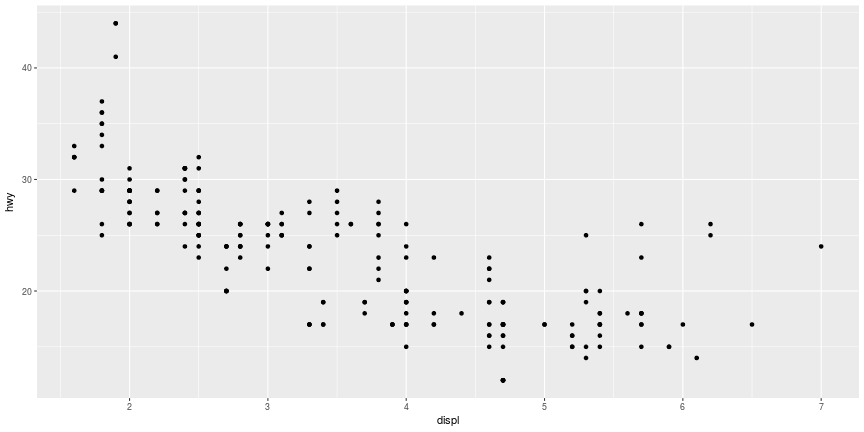

---

## Que es un dispositivo gráfico?

- Un dispositivo gráfico es algo donde se puede almacenar un gráfico
   
   - Una ventana en tu maquina (_screen device_)
  
   - Un archivo PDF (_file device_)

   - Un archivo PNG o JPEG (_file device_)

   - Un archivo vector escalable de gráficos (SVG) (_file device_)

- Cuando haces un gráfico R, ha sido enviado a un dispositivo gráfico en especifico

---

## Como se crea un gráfico en R?

Existen dos formas para gráficar. La primera es la más común:

1. Llamar a la función que gráfica como `plot`, `xyplot`, o `qplot`

2. El gráfico aparece en el dispositivo de pantalla

3. Haga anotaciones si lo considera necesario 

4. Disfrute de su gráfico 


```r
library(datasets)
with(faithful, plot(eruptions, 
                    waiting))  ## Hace que el gráfico aparezca en la pantalla 
title(main = "Old Faithful Geyser data")  ## Añade un titulo (Anotación)
```

---

## Como se crea un gráfico en R?

El segundo método es la más común cuando se trata de utilizar dispositivos tipo archivos.

1. Explicitamente lance un dispositivo gráfico

2. Llame la función que realiza el gráfico (Nota: si esta utilizando un dispositivo gráfico mediante un archivo el gráfico no aparecerá en su pantalla)

3. Realice anotaciones si lo considera necesario

3. Explicitamente cierre el dispositivo gráfico con la función `dev.off()` (es extremadamente importante!)


```r
pdf(file = "myplot.pdf")  ## Abre el dispositivo PDF; crea 'myplot.pdf' en el dt
## Crea el gráfico y lo envia al archivo 
with(faithful, plot(eruptions, waiting))  
title(main = "Old Faithful Geyser data")  ## Añade el titulo; nada en la pantalla
dev.off()  ## Cierra el archivo PDF 
## Ahora puede ver el archivo 'myplot.pdf' en su computadora 
```


---


## Gráficos Base 

Los gráficos de base se utilizan con mayor frecuencia y son muy potentes para crear gráficos en 2-D.

- Existen dos fases para crear un gráfico base 
  - Inicializar un gráfico (función plot)
  - Anotar (añadir capas) a un gráfico existente

- Llamar a la función `plot(x, y)` o `hist(x)` lanzara le dispositivo gráfico 

- Si los argumentos de `plot` no son de alguna clase especial, entonces se llama al método _default_  de`plot`; Esta función tiene muchos argumentos, permitiéndole definir el título, la etiqueta del eje x, la etiqueta del eje y, etc.
- El sistema de gráficos base tiene _muchos_ parámetros que se pueden establecer y ajustar; Estos parámetros están documentados en `?Par`.

---

## Gráficos Base: Histograma


```r
suppressMessages(suppressWarnings(library(datasets)))
hist(airquality$Ozone)  ## Dibuja un gráfico
```

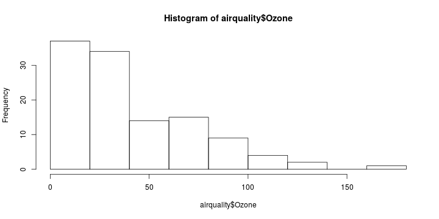

---

## Gráficos Base: Scatterplot


```r
suppressMessages(suppressWarnings(library(datasets)))
with(airquality, plot(Wind, Ozone))
```

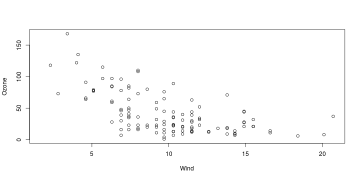

---

## Gráficos Base: Boxplot


```r
suppressMessages(suppressWarnings(library(datasets))) ;data(airquality)
airquality <- transform(airquality, Month = factor(Month))
boxplot(Ozone ~ Month, airquality, xlab = "Month", ylab = "Ozone (ppb)")
```

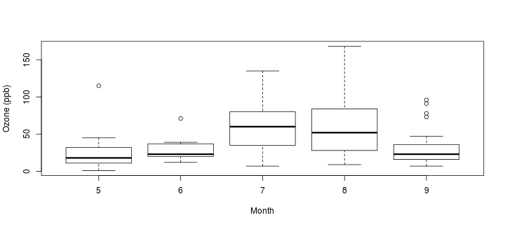

---

## Algunos parámetros importantes 

Muchas funciones del sistema base comparten un conjunto de parámetros. Éstos son algunos de los principales:

- `pch`: símbolo a gráficar en puntos (un circulo por defecto)

- `lty`: el tipo de linea (una linea solida por defecto), puede ser discontinua, punteada, etc.

- `lwd`: el ancho de la linea, especificado como un entero 

- `col`: el color a gráficar, especificado como un número, carácter, o código hexadecimal; la función `colors()` regresa un vector de nombres de colores 

- `xlab`: Cadena de caracteres para la etiqueta del eje x

- `ylab`: Cadena de caracteres para la etiqueta del eje y


---

## Algunos parámetros importantes 

La función `par()` se utiliza para especificar los parámetros __*globales*__ de gráficos  que afectan a todas las gráficas de una sesión en R. Estos parámetros se pueden sobreescribir cuando se especifican como argumentos a funciones de gráficos específicas.

- `las`: La orientación de las etiquetas del eje en el gráfico
- `bg`: El color de fondo
- `mar`: El tamaño del margen
- `oma`: El tamaño del margen externo (por defecto es 0 en todos los lados)
- `mfrow`: Número de gráficos por fila, columna (gráficos por filas)
- `mfcol`: Número de gráficos por fila, columna (gráficos por columnas)

---

## Algunos parámetros importantes 

Valores por defecto para algunos parámetros de gráficos 


```r
par("lty")
```

```
## [1] "solid"
```

```r
par("col")
```

```
## [1] "black"
```

```r
par("pch")
```

```
## [1] 1
```

---

## Algunos parámetros importantes 

Valores por defecto para algunos parámetros de gráficos 


```r
par("bg")
```

```
## [1] "white"
```

```r
par("mar")
```

```
## [1] 5.1 4.1 4.1 2.1
```

```r
par("mfrow")
```

```
## [1] 1 1
```

---

## Funciones de Gráficos Base 

- `plot`: Hace un diagrama de dispersión u otro tipo de gráfico dependiendo de la clase del objeto que se está utilizando

- `lines`: Añade líneas a un gráfico, dado un vector `x` de valores  y un correspondiente vector de valores `y` (o una matriz de 2 columnas); Esta función sólo conecta los puntos

- `points`: Añade puntos a un gráfico
- `text`: Añade etiquetas de texto a un gráfico utilizando coordenadas `x`, `y` especificadas
- `title`: Añade anotaciones a las etiquetas del eje `x`, `y`, título, subtítulo, margen externo 
- `mtext`: Añade texto arbitrario a los márgenes (internos o externos) del gráfico
- `axis`: Añade etiquetas/etiquetas de eje

---

## Gráfico Base con anotación 


```r
suppressMessages(suppressWarnings(library(datasets)))
with(airquality, plot(Wind, Ozone))
title(main = "Ozone and Wind in New York City")  ## Add a title
```

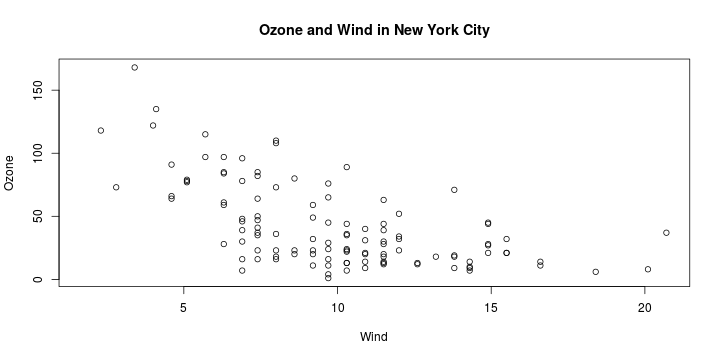

---

## Gráfico Base con anotación 


```r
suppressMessages(suppressWarnings(library(datasets)))
with(airquality, plot(Wind, Ozone, main = "Ozone and Wind in New York City"))
with(subset(airquality, Month == 5), points(Wind, Ozone, col = "blue"))
```

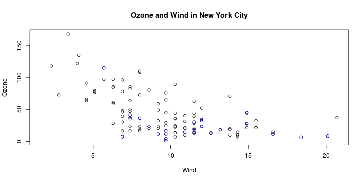

---

## Gráfico Base con anotación 


```r
with(airquality, plot(Wind, Ozone, main = "Ozone and Wind in New York City", type = "n"))
with(subset(airquality, Month == 5), points(Wind, Ozone, col = "blue"))
with(subset(airquality, Month != 5), points(Wind, Ozone, col = "red"))
legend("topright", pch = 1, col = c("blue", "red"), legend = c("May", "Other Months"))
```

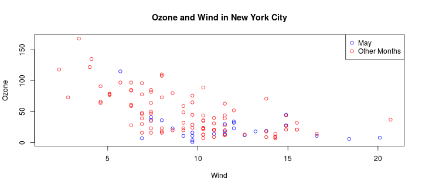

---

## Multiples gráficos Base 


```r
par(mfrow = c(1, 2))
with(airquality, {
	plot(Wind, Ozone, main = "Ozone and Wind")
	plot(Solar.R, Ozone, main = "Ozone and Solar Radiation")
})
```

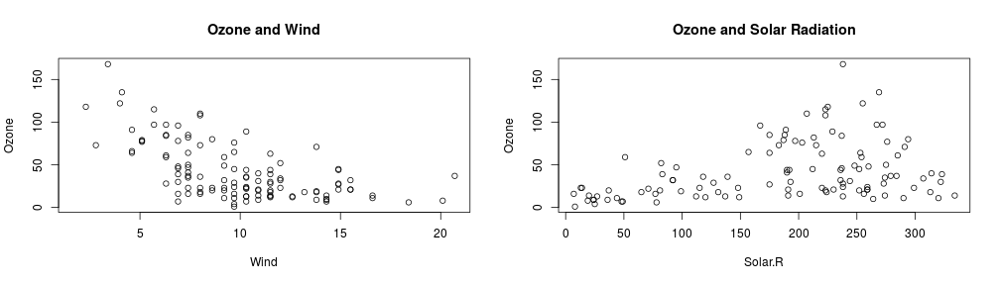

---

## Multiples gráficos Base 


```r
par(mfrow = c(1, 3), mar = c(4, 4, 2, 1), oma = c(0, 0, 2, 0))
with(airquality, {
	plot(Wind, Ozone, main = "Ozone and Wind")
	plot(Solar.R, Ozone, main = "Ozone and Solar Radiation")
	plot(Temp, Ozone, main = "Ozone and Temperature")
	mtext("Ozone and Weather in New York City", outer = TRUE)
})
```

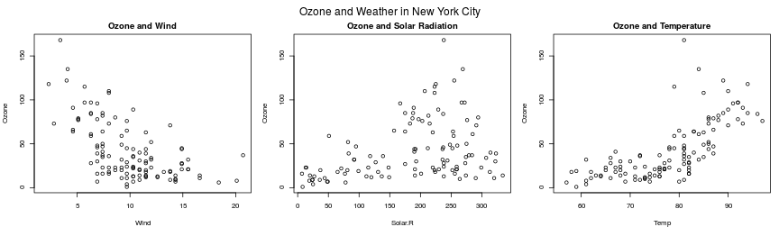

---

## Sistema de gráficos lattice 

El sistema de gráficos lattice se implemento utilizando los siguientes paquetes:

- *lattice*: contiene el código para producir gráficos tipo _trellis_ el cual es independiente del sistema base, incluye funciones como: `xyplot`, `bwplot`, `levelplot`

- *grid*: implementa diferentes sistemas gráficos independientes del sistema base, el paquete *lattice* se construyó con base a *grid*

- El sistema lattice no tiene el sistema de dos fases, aspecto que lo separa bastante del sistema base 

---

## Funciones lattice

- `xyplot`: esta es la función principal, crea diagrama de puntos 
- `bwplot`: gráficos box-and-whiskers, (“boxplots”)
- `histogram`: histogramas
- `stripplot`: como un boxplot pero con puntos 
- `dotplot`: gráficos de puntos en forma de "violín"
- `splom`: scatterplot matrix; como `pairs` en el sistema base
- `levelplot`, `contourplot`: para graficar datos de "imágenes"

---

## Funciones lattice 

Las funciones de lattice generalmente toman una formula como primer argumento, 
de la siguiente forma:

```r
xyplot(y ~ x | f * g, data)
```

- Se utiliza la *notación de formula*, debido al `~`.

- Al lado izquierdo de `~` esta la variable del eje y, en el lado derecho esta la variable del eje x

- f y g son _variables condicionales_ — son opcionales 
  - el `*` indica interacción entre las variables 

- El segundo argumento es el data frame o lista del cual se obtendrán las variables de la formula 

- Sino se especifica ningún otro argumento, se establecerán el resto de valores por defecto.

---

## Gráficos Lattice 


```r
suppressMessages(suppressWarnings(library(lattice)))
suppressMessages(suppressWarnings(library(datasets)))
xyplot(Ozone ~ Wind, data = airquality)
```

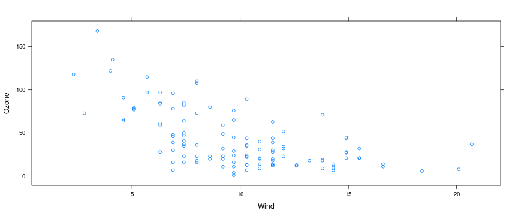

---

## Gráficos Lattice 


```r
suppressMessages(suppressWarnings(library(lattice)))
suppressMessages(suppressWarnings(library(datasets)))
airquality <- transform(airquality, Month = factor(Month)) 
xyplot(Ozone ~ Wind | Month, data = airquality, layout = c(5, 1))
```

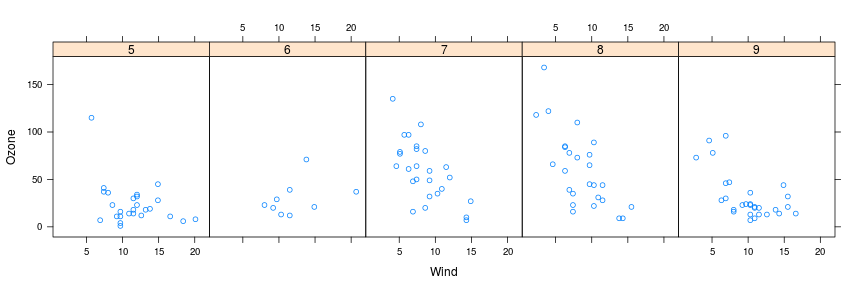

---

## Lattice Comportamiento 


```r
p <- xyplot(Ozone ~ Wind, data = airquality)  # Nada pasa!
print(p)  # Aparece el gráfico!
```

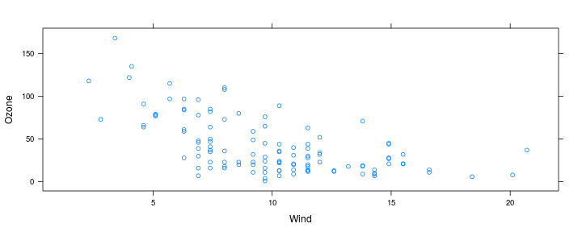

```r
xyplot(Ozone ~ Wind, data = airquality)  ## Auto-impresión 
```

---

## Lattice funciones panel

- Las funciones lattice tienen ** funciones panel ** las cuales controlan lo que pasa dentro de cada panel del gráfico

- El paquete *lattice* viene con funciones panel por defecto, pero se pueden implementar algunos cambios para lo que pasa dentro de cada panel 

- Las funciones panel reciben las coordenadas x/y de los puntos en su panel


---

##  Lattice funciones panel


```r
set.seed(10)
x <- rnorm(100)
f <- rep(0:1, each = 50)
y <- x + f - f * x + rnorm(100, sd = 0.5)
f <- factor(f, labels = c("Group 1", "Group 2"))
xyplot(y ~ x | f, layout = c(2, 1))  ## gráfico con 2 paneles
```

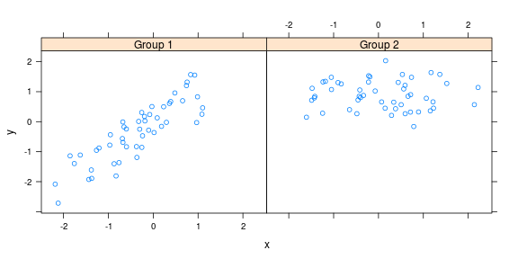

---

## Lattice funciones panel


```r
xyplot(y ~ x | f, panel = function(x, y, ...) {
       panel.xyplot(x, y, ...) ## primer llamado a la función panel por 'xyplot'
       panel.abline(h = median(y), lty = 2)  ## Añade una linea horizontal en la media 
})
```

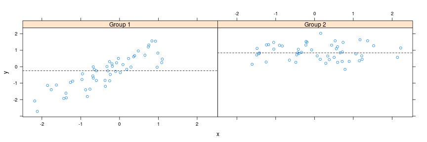

---

## Lattice funciones panel: Linea de regresión 


```r
xyplot(y ~ x | f, panel = function(x, y, ...) {
               panel.xyplot(x, y, ...)  
               panel.lmline(x, y, col = 2)  
       })
```

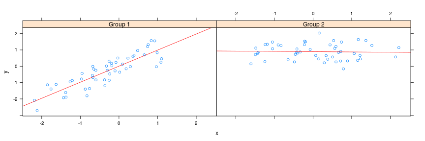

---

## Paneles en Lattice 

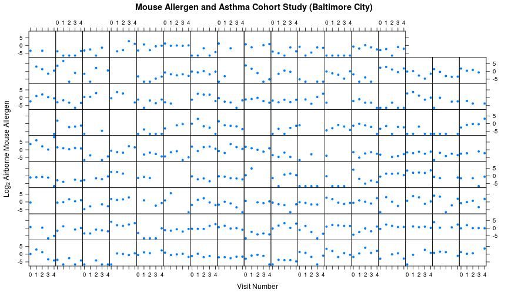

---

## ¿Que es ggplot2?

- Grammar of Graphics representa una abstracción de gráficos ideas/objetos
- Piense en "verbos", "sustantivos", "adjetivos" para gráficos
- Aplica una nueva "teoría" de gráficas sobre la cual construir nuevos objetos 
- "Acortar la distancia de la mente a la página"

---

## Grammar of Graphics

### “In brief, the grammar tells us that a statistical graphic is a __mapping__ from data to __aesthetic__ attributes (colour, shape, size) of __geometric__ objects (points, lines, bars). The plot may also contain statistical transformations of the data and is drawn on a specific coordinate system”

- Tomado de _ggplot2_ book

---

## Lo Básico: `qplot()`

- Trabaja muy parecido a la función `plot()` en el sistema base
- Toma los datos desde un _data_ _frame_, similar a _Lattice_
- Los gráficos de componen de _aesthetics_ (size, shape, color) y _geoms_ (points, lines) 

---

## Lo Básico: `qplot()`

- Los factores son importantes para indicar subconjuntos de datos 
- `qplot()` oculta que pasa por debajo, lo que esta bien para la mayoría de las operaciones 
- `ggplot()` es la función principal y es muy flexible para hacer cosas que `qplot()` no hace

---

## Dataset ejemplo 


```r
suppressMessages(suppressWarnings(library(ggplot2)))
str(mpg)
```

```
## Classes 'tbl_df', 'tbl' and 'data.frame':	234 obs. of  11 variables:
##  $ manufacturer: chr  "audi" "audi" "audi" "audi" ...
##  $ model       : chr  "a4" "a4" "a4" "a4" ...
##  $ displ       : num  1.8 1.8 2 2 2.8 2.8 3.1 1.8 1.8 2 ...
##  $ year        : int  1999 1999 2008 2008 1999 1999 2008 1999 1999 2008 ...
##  $ cyl         : int  4 4 4 4 6 6 6 4 4 4 ...
##  $ trans       : chr  "auto(l5)" "manual(m5)" "manual(m6)" "auto(av)" ...
##  $ drv         : chr  "f" "f" "f" "f" ...
##  $ cty         : int  18 21 20 21 16 18 18 18 16 20 ...
##  $ hwy         : int  29 29 31 30 26 26 27 26 25 28 ...
##  $ fl          : chr  "p" "p" "p" "p" ...
##  $ class       : chr  "compact" "compact" "compact" "compact" ...
```

---

## ggplot2 “Hello, world!”


```r
qplot(displ, hwy, data = mpg)
```

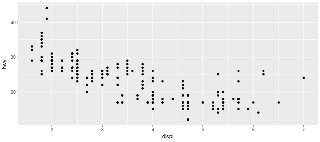

---

## Modificar aesthetics


```r
qplot(displ, hwy, data = mpg, color = drv)
```

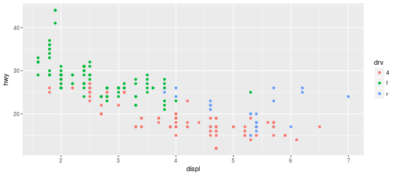

---

## Añadir un geom


```r
qplot(displ, hwy, data = mpg, geom = c("point", "smooth"))
```

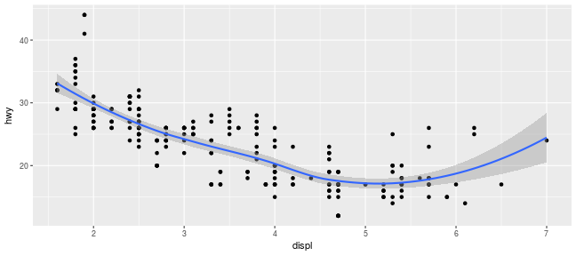

---

## Histogramas


```r
qplot(hwy, data = mpg, fill = drv)
```

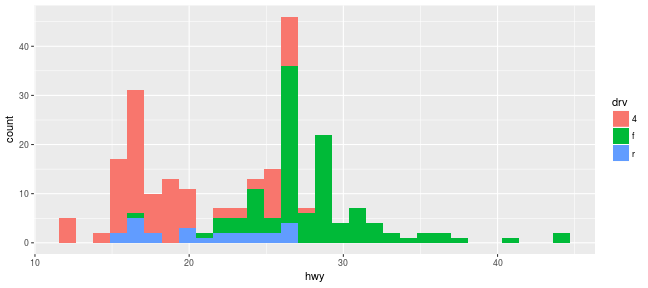

---

## Facets


```r
suppressMessages(suppressWarnings(library(gridExtra)))
p1 <- qplot(displ, hwy, data = mpg, facets = . ~ drv)
p2 <- qplot(hwy, data = mpg, facets = drv ~ ., binwidth = 2)
grid.arrange(p1, p2, ncol=2)
```

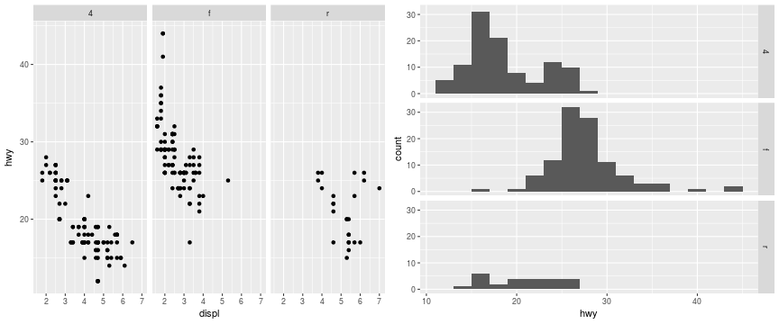

---
## Ejemplo : Batata

- Diseño factorial planteado en un estudio de investigación Ing. de Alimentos
- Se busca  determinar diferencias en los tratamientos para las variables _Grasa_ y _Humedad_
- Se tienen en cuenta los factores _Recubrimiento_ y _Temperatura_


---

## Ejemplo: Batata


```r
str(Batata)
```

```
## 'data.frame':	108 obs. of  6 variables:
##  $ RECUBRIMIENTO: Factor w/ 2 levels "0","0.5": 2 2 2 2 2 2 2 2 2 2 ...
##  $ TEMPERATURA  : Factor w/ 3 levels "150","170","190": 1 1 1 1 1 1 1 1 1 1 ...
##  $ TIEMPO       : Factor w/ 6 levels "30","60","120",..: 1 1 1 2 2 2 3 3 3 4 ...
##  $ REP          : int  1 2 3 1 2 3 1 2 3 1 ...
##  $ HUMEDAD      : num  0.0774 0.0718 0.07 0.1363 0.1323 ...
##  $ GRASA        : num  0.022 0.023 0.0213 0.0458 0.0456 0.0458 0.0499 0.0519 0.0503 0.0562 ...
```

---

## Histograma para la Humedad  


```r
qplot(HUMEDAD, data = Batata)
```

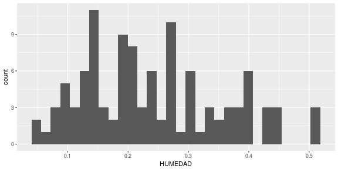

---

## Histograma por grupos 


```r
qplot(GRASA, data = Batata, fill = TEMPERATURA)
```

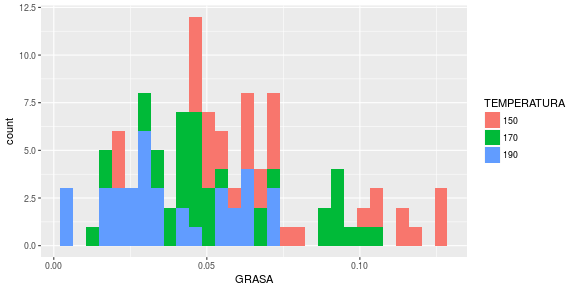

---

## Densidades 


```r
p1 <- qplot(GRASA, data = Batata, geom = "density")
p2 <- qplot(GRASA, data = Batata, geom = "density", color=TIEMPO);
grid.arrange(p1, p2, ncol=2)
```

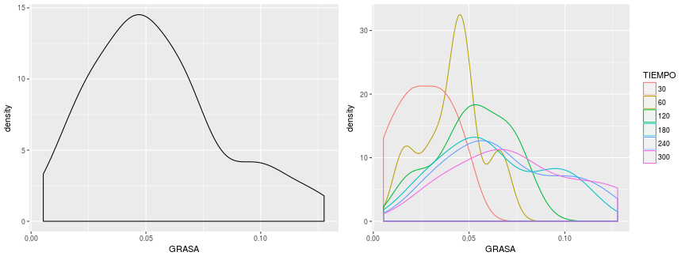

---

## Scatterplots: Grasa vs. Humedad


```r
qplot(GRASA, HUMEDAD, data = Batata)
```

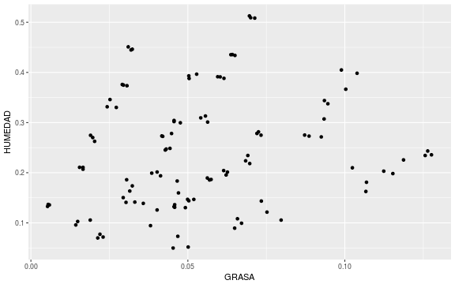

---

## Scatterplots: Grasa vs. Humedad


```r
p2 <- qplot(GRASA, HUMEDAD, data = Batata, shape = RECUBRIMIENTO)
p3 <- qplot(GRASA, HUMEDAD, data = Batata, color = RECUBRIMIENTO)
grid.arrange(p2, p3, ncol=2)
```

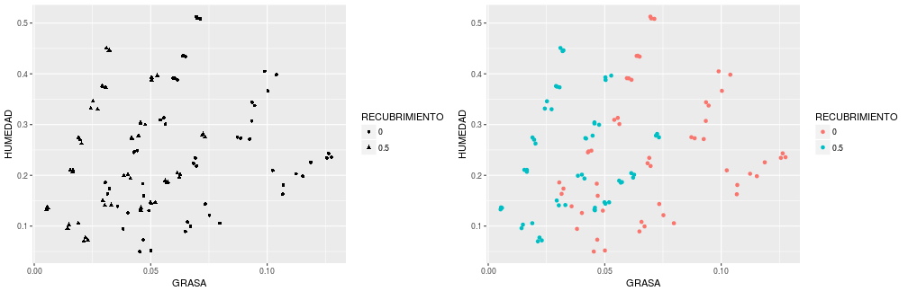

---

## Scatterplots: Grasa vs. Humedad


```r
qplot(GRASA, HUMEDAD, data = Batata,color=TEMPERATURA,
      geom = c("point", "smooth"), method = "lm")
```

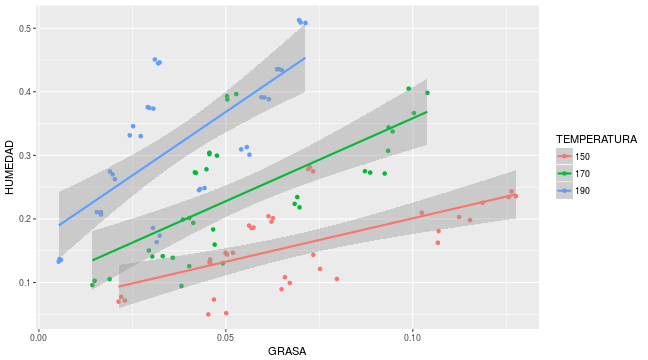

---

## Scatterplots: Grasa vs. Humedad


```r
qplot(GRASA, HUMEDAD, data = Batata, geom = c("point", "smooth"),  
      method = "lm", facets = . ~ TEMPERATURA)
```

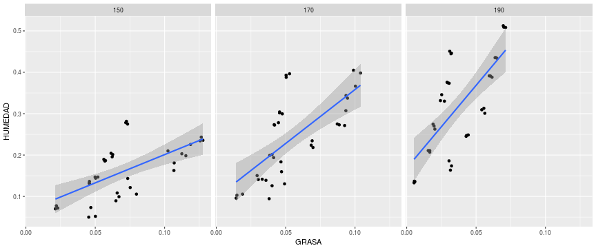

---

## Resumen de `qplot()`

- La función `qplot()` es la análoga a `plot()` pero con muchas características integradas
- Sintaxis en algún lugar entre base/lattice
- Produce muy buenos gráficos, esencialmente listos para una publicación (si te gusta el diseño)
- Difícil de personalizar (no te molestes, el uso de todo el potencial de ggplot2 complementa este caso)

---

## Recursos

- The _ggplot2_ book por Hadley Wickham
- The _R Graphics Cookbook_ por Winston Chang (ejemplos en el sistema base y ggplot2)
- ggplot2 web site (http://ggplot2.org)
- ggplot2 mailing list (http://goo.gl/OdW3uB), principalmente para desarrolladores

---

## Componentes básicos de un gráfico en ggplot2
- Un _data frame_
- _aesthetic mappings_: cómo a los datos se le asignan color, size 
- _geoms_: objetos geometricos como points, lines, shapes. 
- _facets_: Para gráficos condicionales. 
- _stats_: Transformaciones estadísticas como binning, quantiles, smoothing. 
- _scales_: qué escala de mapeo estético se utiliza (ejemplo: Hombre = red, Mujer = blue). 
- _Sistema de coordenadas_ 

---

## Construyendo gráficos con ggplot2
* Cuando construimos gráficos en ggplot2 (y no utilizamos qplot) el modelo “artist’s palette” puede ser la analogía más cercana
* Los gráficos se construyen en capas
  - Se grafican los datos
  - Se hace una superposición tipo resumen
  - Metadata y anotación 

---

## Ejemplo : Batata

- Diseño factorial planteado en un estudio de investigación Ing. de Alimentos
- Se busca  determinar diferencias en los tratamientos para las variables _Grasa_ y _Humedad_
- Se tienen en cuenta los factores _Recubrimiento_ y _Temperatura_


---

## Gráfico básico 


```r
qplot(GRASA, HUMEDAD, data = Batata, geom = c("point", "smooth"),  
      method = "lm", facets = . ~ TEMPERATURA)
```


---

## La construcción por capas


```r
head(Batata, 3)
```

```
##   RECUBRIMIENTO TEMPERATURA TIEMPO REP HUMEDAD  GRASA
## 1           0.5         150     30   1  0.0774 0.0220
## 2           0.5         150     30   2  0.0718 0.0230
## 3           0.5         150     30   3  0.0700 0.0213
```

```r
p <- ggplot(Batata, aes(GRASA, HUMEDAD))
summary(p)
```

```
## data: RECUBRIMIENTO, TEMPERATURA, TIEMPO, REP, HUMEDAD, GRASA
##   [108x6]
## mapping:  x = GRASA, y = HUMEDAD
## faceting: <ggproto object: Class FacetNull, Facet, gg>
##     compute_layout: function
##     draw_back: function
##     draw_front: function
##     draw_labels: function
##     draw_panels: function
##     finish_data: function
##     init_scales: function
##     map_data: function
##     params: list
##     setup_data: function
##     setup_params: function
##     shrink: TRUE
##     train_scales: function
##     vars: function
##     super:  <ggproto object: Class FacetNull, Facet, gg>
```

---

## Sin gráfico aún !


```r
p <- ggplot(Batata, aes(GRASA, HUMEDAD))
print(p)
```

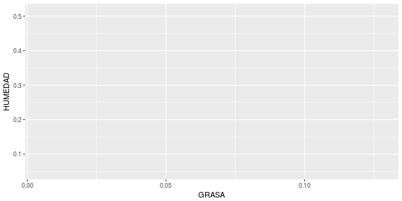

---

## Primer gráfico con capa point 


```r
p <- ggplot(Batata, aes(GRASA, HUMEDAD))
p + geom_point()
```

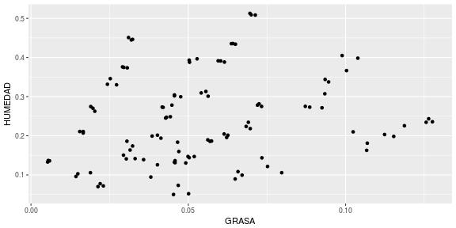

---

## Añadiendo mas capas: Smooth


```r
p <- ggplot(Batata, aes(GRASA, HUMEDAD))
p + geom_point()+ geom_smooth(method = "lm")
```

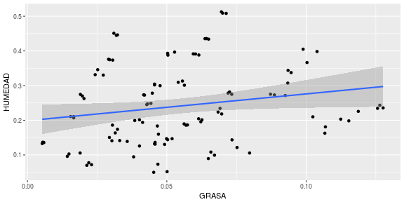

---

## Añadiendo mas capas: Facets


```r
p <- ggplot(Batata, aes(GRASA, HUMEDAD))
p + geom_point() + facet_grid(. ~ TEMPERATURA)+ geom_smooth(method = "lm")
```

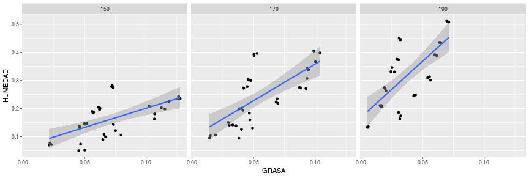

---

## Anotación
- Labels: `xlab()`, `ylab()`, `labs()`, `ggtitle()`
- Cada una de las funciones “geom” tiene opciones para modificar 
- Para las cosas que sólo tienen sentido globalmente, use `theme()` 
  - Ejemplo: `theme(legend.position = "none")` 
- Se incluyen dos temas de apariencia estándar 
  - `theme_gray()`: El tema por defecto (gray background)
  - `theme_bw()`: Más stark/plain 

---

## Modificando Aesthetics


```r
grid.arrange(p + geom_point(color = "steelblue", size = 4, alpha = 1/2), 
             p + geom_point(aes(color = TEMPERATURA), size = 4, alpha = 1/2), ncol=2)
```

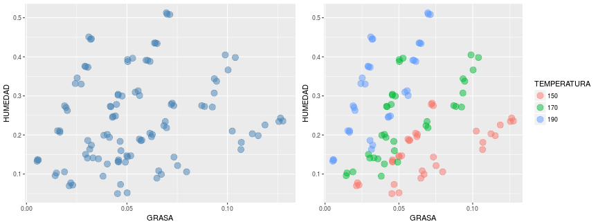

---

## Modificando Labels


```r
p + geom_point(aes(color = TEMPERATURA)) + 
  labs(title='Datos del estudio Batata', x = "Grasa" , y = expression(Humedad[(g/kg)]))
```

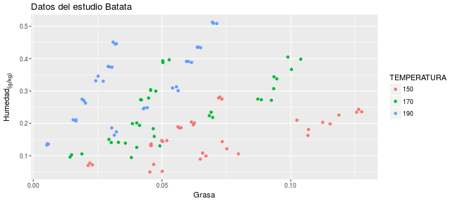

---

## Personalizando el Smooth


```r
p + geom_point(aes(color = TEMPERATURA), size = 2, alpha = 1/2) +
        geom_smooth(size = 4, linetype = 3, method = "lm", se = FALSE)
```

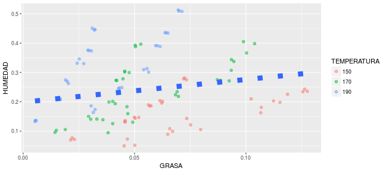

---

## Cambiando el Theme


```r
p + geom_point(aes(color = TEMPERATURA)) + theme_bw(base_family = "Times")
```

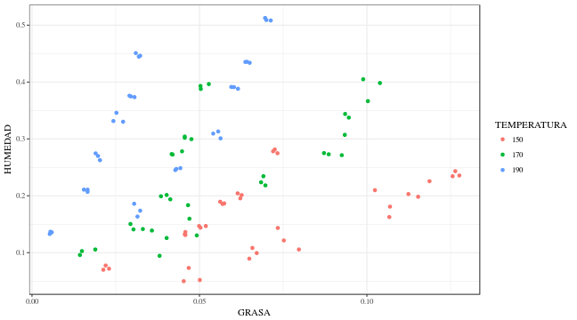

---

## Gráfico Final 

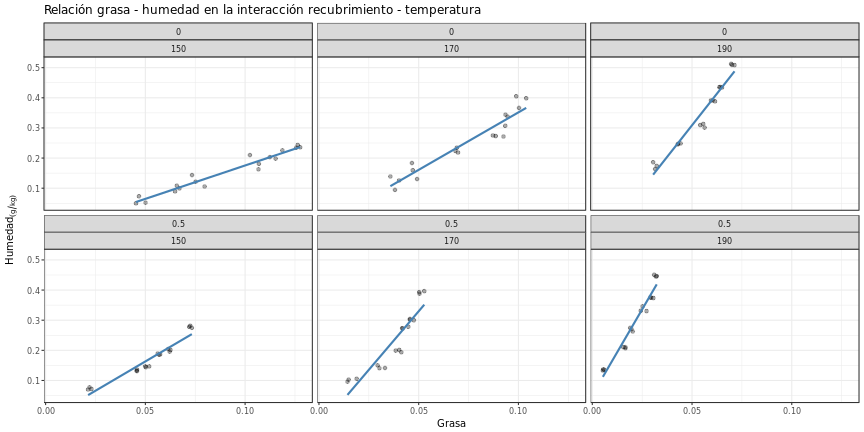

---

## Gráfico Final - Código 


```r
g<-ggplot(Batata, aes(GRASA, HUMEDAD))

## Add layers
g + geom_point(alpha = 1/3) + 
        facet_wrap(RECUBRIMIENTO ~ TEMPERATURA) + 
        geom_smooth(method="lm", se=FALSE, col="steelblue") + 
        theme_bw(base_family = "Avenir", base_size = 10) + 
        labs(x = "Grasa") + 
        labs(y = expression( Humedad [(g/kg)])) + 
        labs(title = "Relación grasa - humedad en la interacción 
             recubrimiento - temperatura ")
```

---

## Resumen
- ggplot2 es muy poderoso y flexible si aprendes  “The grammar” y los varios elementos que pueden ser modificados 
- Muchos más tipos de gráficos pueden ser hechos; explora y pierdele un tiempo al paquete

---

## Recursos 

- The _ggplot2_ book por Hadley Wickham
- The _R Graphics Cookbook_ por Winston Chang (ejemplos en el sistema base y ggplot2)
- ggplot2 web site (http://ggplot2.org)
- ggplot2 mailing list (http://goo.gl/OdW3uB), principalmente para desarrolladores

---

## Motivación gráficos interactivos


<div id = 'chart1' class = 'rChart nvd3'></div>
<script type='text/javascript'>
 $(document).ready(function(){
      drawchart1()
    });
    function drawchart1(){  
      var opts = {
 "dom": "chart1",
"width":    800,
"height":    400,
"x": "Hair",
"y": "Freq",
"group": "Eye",
"type": "multiBarChart",
"id": "chart1" 
},
        data = [
 {
 "Hair": "Black",
"Eye": "Brown",
"Sex": "Male",
"Freq":             32 
},
{
 "Hair": "Brown",
"Eye": "Brown",
"Sex": "Male",
"Freq":             53 
},
{
 "Hair": "Red",
"Eye": "Brown",
"Sex": "Male",
"Freq":             10 
},
{
 "Hair": "Blond",
"Eye": "Brown",
"Sex": "Male",
"Freq":              3 
},
{
 "Hair": "Black",
"Eye": "Blue",
"Sex": "Male",
"Freq":             11 
},
{
 "Hair": "Brown",
"Eye": "Blue",
"Sex": "Male",
"Freq":             50 
},
{
 "Hair": "Red",
"Eye": "Blue",
"Sex": "Male",
"Freq":             10 
},
{
 "Hair": "Blond",
"Eye": "Blue",
"Sex": "Male",
"Freq":             30 
},
{
 "Hair": "Black",
"Eye": "Hazel",
"Sex": "Male",
"Freq":             10 
},
{
 "Hair": "Brown",
"Eye": "Hazel",
"Sex": "Male",
"Freq":             25 
},
{
 "Hair": "Red",
"Eye": "Hazel",
"Sex": "Male",
"Freq":              7 
},
{
 "Hair": "Blond",
"Eye": "Hazel",
"Sex": "Male",
"Freq":              5 
},
{
 "Hair": "Black",
"Eye": "Green",
"Sex": "Male",
"Freq":              3 
},
{
 "Hair": "Brown",
"Eye": "Green",
"Sex": "Male",
"Freq":             15 
},
{
 "Hair": "Red",
"Eye": "Green",
"Sex": "Male",
"Freq":              7 
},
{
 "Hair": "Blond",
"Eye": "Green",
"Sex": "Male",
"Freq":              8 
} 
]
  
      if(!(opts.type==="pieChart" || opts.type==="sparklinePlus" || opts.type==="bulletChart")) {
        var data = d3.nest()
          .key(function(d){
            //return opts.group === undefined ? 'main' : d[opts.group]
            //instead of main would think a better default is opts.x
            return opts.group === undefined ? opts.y : d[opts.group];
          })
          .entries(data);
      }
      
      if (opts.disabled != undefined){
        data.map(function(d, i){
          d.disabled = opts.disabled[i]
        })
      }
      
      nv.addGraph(function() {
        var chart = nv.models[opts.type]()
          .width(opts.width)
          .height(opts.height)
          
        if (opts.type != "bulletChart"){
          chart
            .x(function(d) { return d[opts.x] })
            .y(function(d) { return d[opts.y] })
        }
          
         
        
          
        

        
        
        
      
       d3.select("#" + opts.id)
        .append('svg')
        .datum(data)
        .transition().duration(500)
        .call(chart);

       nv.utils.windowResize(chart.update);
       return chart;
      });
    };
</script>

--- 

## Motivación gráficos interactivos

<!-- MotionChart generated in R 3.4.0 by googleVis 0.6.2 package -->
<!-- Sat Jun 24 16:59:14 2017 -->


<!-- jsHeader -->
<script type="text/javascript">
 
// jsData 
function gvisDataMotionChartID5639142166de () {
var data = new google.visualization.DataTable();
var datajson =
[
 [
"Apples",
2008,
"West",
98,
78,
20,
"2008-12-31"
],
[
"Apples",
2009,
"West",
111,
79,
32,
"2009-12-31"
],
[
"Apples",
2010,
"West",
89,
76,
13,
"2010-12-31"
],
[
"Oranges",
2008,
"East",
96,
81,
15,
"2008-12-31"
],
[
"Bananas",
2008,
"East",
85,
76,
9,
"2008-12-31"
],
[
"Oranges",
2009,
"East",
93,
80,
13,
"2009-12-31"
],
[
"Bananas",
2009,
"East",
94,
78,
16,
"2009-12-31"
],
[
"Oranges",
2010,
"East",
98,
91,
7,
"2010-12-31"
],
[
"Bananas",
2010,
"East",
81,
71,
10,
"2010-12-31"
] 
];
data.addColumn('string','Fruit');
data.addColumn('number','Year');
data.addColumn('string','Location');
data.addColumn('number','Sales');
data.addColumn('number','Expenses');
data.addColumn('number','Profit');
data.addColumn('string','Date');
data.addRows(datajson);
return(data);
}
 
// jsDrawChart
function drawChartMotionChartID5639142166de() {
var data = gvisDataMotionChartID5639142166de();
var options = {};
options["width"] = 600;
options["height"] = 400;
options["state"] = "";

    var chart = new google.visualization.MotionChart(
    document.getElementById('MotionChartID5639142166de')
    );
    chart.draw(data,options);
    

}
  
 
// jsDisplayChart
(function() {
var pkgs = window.__gvisPackages = window.__gvisPackages || [];
var callbacks = window.__gvisCallbacks = window.__gvisCallbacks || [];
var chartid = "motionchart";
  
// Manually see if chartid is in pkgs (not all browsers support Array.indexOf)
var i, newPackage = true;
for (i = 0; newPackage && i < pkgs.length; i++) {
if (pkgs[i] === chartid)
newPackage = false;
}
if (newPackage)
  pkgs.push(chartid);
  
// Add the drawChart function to the global list of callbacks
callbacks.push(drawChartMotionChartID5639142166de);
})();
function displayChartMotionChartID5639142166de() {
  var pkgs = window.__gvisPackages = window.__gvisPackages || [];
  var callbacks = window.__gvisCallbacks = window.__gvisCallbacks || [];
  window.clearTimeout(window.__gvisLoad);
  // The timeout is set to 100 because otherwise the container div we are
  // targeting might not be part of the document yet
  window.__gvisLoad = setTimeout(function() {
  var pkgCount = pkgs.length;
  google.load("visualization", "1", { packages:pkgs, callback: function() {
  if (pkgCount != pkgs.length) {
  // Race condition where another setTimeout call snuck in after us; if
  // that call added a package, we must not shift its callback
  return;
}
while (callbacks.length > 0)
callbacks.shift()();
} });
}, 100);
}
 
// jsFooter
</script>
 
<!-- jsChart -->  
<script type="text/javascript" src="https://www.google.com/jsapi?callback=displayChartMotionChartID5639142166de"></script>
 
<!-- divChart -->
  
<div id="MotionChartID5639142166de" 
  style="width: 600; height: 400;">
</div>

---

# Motivación gráficos interactivos


```r
slidifyUI(
sidebarLayout(        
  sidebarPanel(
    selectInput('sex', 'Choose Sex', c('Male', 'Female'), width = '100px'),
    selectInput('type', 'Choose Type',
      c('multiBarChart', 'multiBarHorizontalChart'), width = '200px'
    )
  ),
  mainPanel(
    tags$div(id = 'nvd3plot', class='shiny-html-output nvd3 rChart')
  ),position = "left", fluid = FALSE
)
  )
```

```
## Error in slidifyUI(sidebarLayout(sidebarPanel(selectInput("sex", "Choose Sex", : no se pudo encontrar la función "slidifyUI"
```


